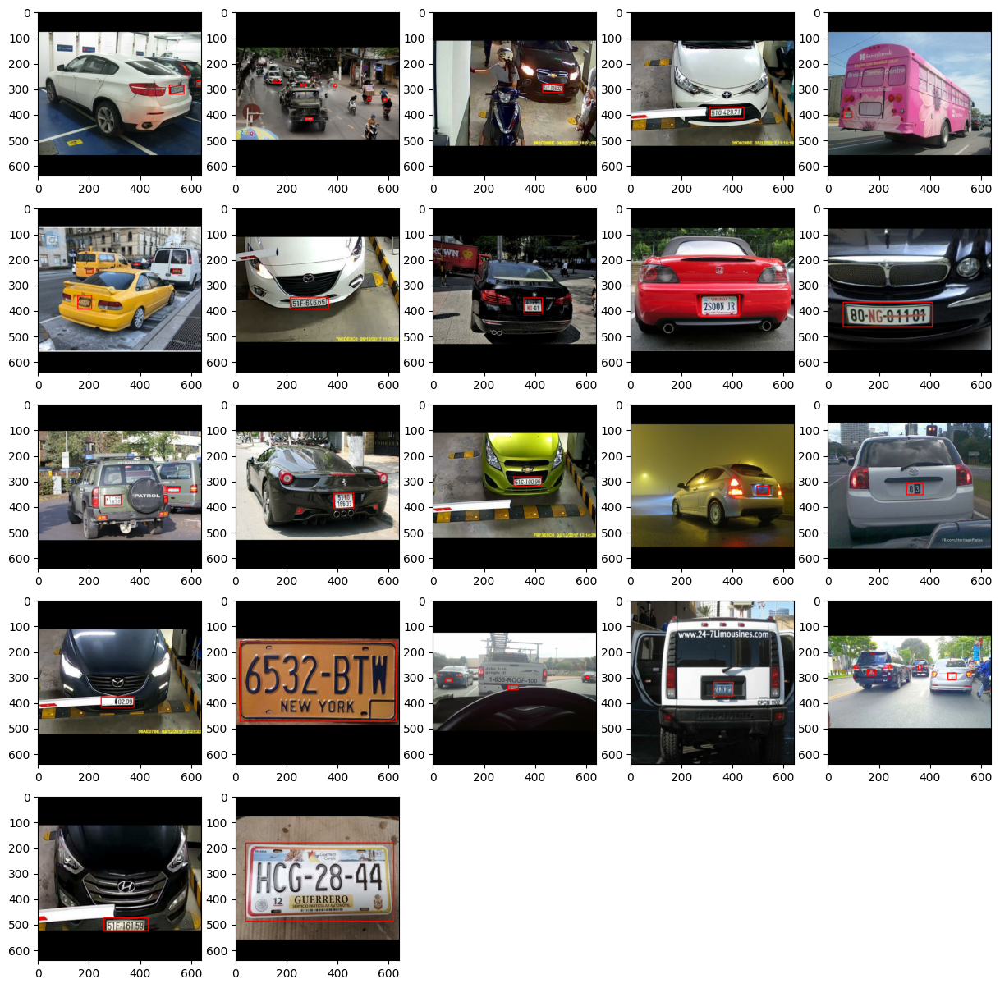
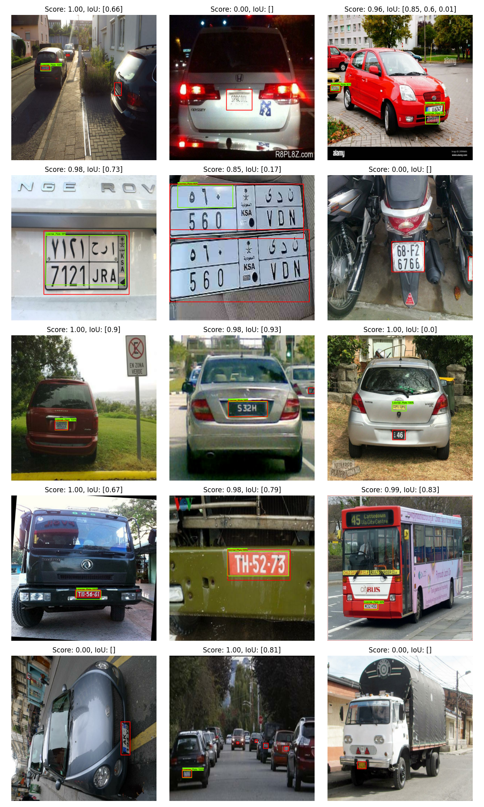

# 🚗 License Plate Detection Project

## 📝 Project Overview

The project uses license plate detection datasets from [robolfow-license-plate-recognition](https://universe.roboflow.com/roboflow-universe-projects/license-plate-recognition-rxg4e) and [kaggle-car-plate-detection](https://www.kaggle.com/datasets/andrewmvd/car-plate-detection/data).
* There are only 22 images for training, 12 validation and 16 for testing. therefore transfer learning is used with ssd_resnet50_v1_fpn_640x640 model from Tensorflow model garden.
* [Tensorflow's Object detection API](https://github.com/tensorflow/models/tree/master/research/object_detection) is used to train model and visulize data.


## 🚀 Key Features

- Model used for transfer learning - [ssd_resnet50_v1_fpn_640x640](http://download.tensorflow.org/models/object_detection/tf2/20200711/ssd_resnet50_v1_fpn_640x640_coco17_tpu-8.tar.gz) 
- Model trained on Custom loop using `tf.GradientTape()`, for more information look into [2_model_training notebook](notebooks/02_model_training.ipynb)


## 🛠️ Technologies Used

- Python
- Jupyter Notebook
- [Tensorflow's Object detection API](https://github.com/tensorflow/models/tree/master/research/object_detection)


## 📊 Model Training
Exploratory data analisis is done in `01_exploratory_data_analyis_EDA.ipynb` [notebook](license-plate-recognition/notebooks/01_exploratory_data_analyis_EDA.ipynb)
The model training process is detailed in `02_model_training.ipynb` [notebook](license-plate-recognition/notebooks/02_model_training.ipynb). This notebook covers:

- Data preprocessing
- Model architecture
- Training pipeline
- Evaluation metrics


## 🔧 Setup and Installation

1. Clone the Repo
2. Install vs code with [docker](https://marketplace.visualstudio.com/items?itemName=ms-azuretools.vscode-docker) and [devcontainer](https://marketplace.visualstudio.com/items?itemName=ms-vscode-remote.remote-containers) extension
3. press `Ctrl+Shift+P` and select `Dev Containers: Rebuild and Reopen in Container`
4. setup .env file with kaggle keys to download dataset directly (move it into datasets dir)
5. open conf/config.yaml for configuring parameters and path

### My Hardware Info

To run this project smoothly, consider the following hardware:

- **CPU**: AMD Ryzen 5900X
- **GPU**: NVIDIA GeForce RTX 3080 (with 10GB VRAM)
- **RAM**: 32 GB DDR4


## 🚀 Detection Results: A Visual Showcase

Dive into the performance of our object detection model with these compelling visualizations. Each image demonstrates the model's ability to locate and classify objects.
The minimum loss achieved on my hardware was approximately 0.0264, using the following hyperparameters:
```Python
batch_size = 8
EPOCHS = 250
learning_rate = 1e-4
decay_steps = 30 
decay_rate = 0.90

lr_schedule = tf.keras.optimizers.schedules.ExponentialDecay(
    initial_learning_rate=learning_rate,
    decay_steps=decay_steps,
    decay_rate=decay_rate,
    staircase=True
)

```

**Key Visual Elements:**

* **<span style="color:green;">Green Bounding Boxes:</span>** Represent the model's predicted object locations.
* **<span style="color:red;">Red Bounding Boxes:</span>** Indicate the actual ground truth object locations.

* **Title Metrics:** Each image is labeled with:
    * **Score:** The model's confidence in its prediction (higher is better).
    * **IoU (Intersection over Union):** A measure of the overlap between predicted and ground truth boxes (closer to 1.0 is better).

**Visual Results:**



**Interactive Insights:**

To better understand the nuances of the model's performance, consider the following:

* **High Score, High IoU:** These images showcase the model's precision, indicating accurate object localization and high confidence.
* **High Score, Lower IoU:** These cases might reveal instances where the model confidently detects an object but with slight localization errors.
* **Lower Score, Lower IoU:** These instances indicate the model's challenges in accurately detecting or localizing objects.

**Analysis:**

The results demonstrate the model's ability to accurately find the objects. The IoU values show that the model is able to accurately localize the objects.

**Further Exploration:**

To delve deeper into the model's performance, consider:

* Try to minimize loss further down to `>0.001` (current loss is `0.0264`) with setting up proper data processing pipeline (`tf.data.Dataset`) and Hyper parameter tuning.
* Analyzing the model's failure cases to identify potential areas for improvement.
