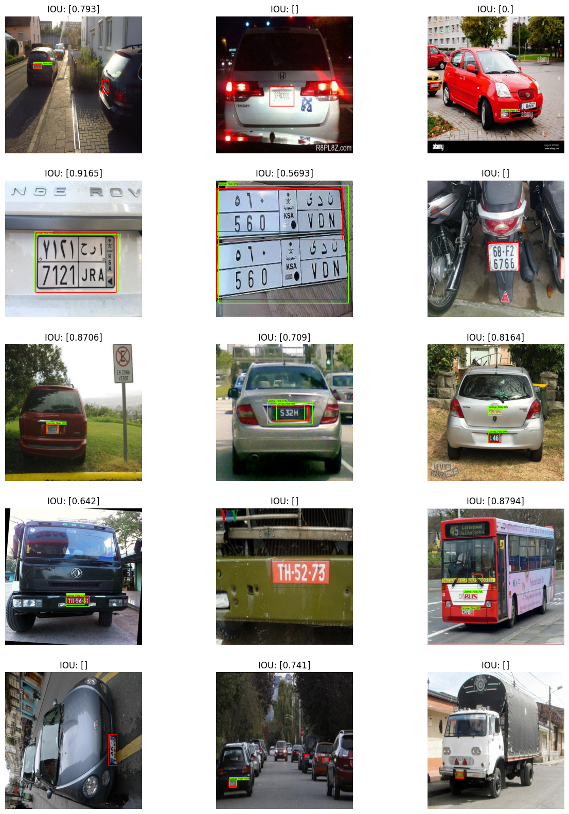

# 🚗 License Plate Detection Project

## 📝 Project Overview

The project uses license plate detection datasets from [robolfow](https://universe.roboflow.com/roboflow-universe-projects/license-plate-recognition-rxg4e).
* There are only 22 images for training, 12 validation and 16 for testing. therefore transfer learning is used with ssd_resnet50_v1_fpn_640x640 model from Tensorflow model garden.
* [Tensorflow's Object detection API](https://github.com/tensorflow/models/tree/master/research/object_detection) is used to train model and visulize data.

## 🚀 Key Features

- [ssd_resnet50_v1_fpn_640x640](http://download.tensorflow.org/models/object_detection/tf2/20200711/ssd_resnet50_v1_fpn_640x640_coco17_tpu-8.tar.gz) 
- 

## 🛠️ Technologies Used

- Python
- Jupyter Notebook
- [Tensorflow's Object detection API](https://github.com/tensorflow/models/tree/master/research/object_detection)

## 📊 Model Training
Exploratory data analisis is done in `01_exploratory_data_analyis_EDA.ipynb` [notebook](license-plate-recognition/notebooks/01_exploratory_data_analyis_EDA.ipynb)
The model training process is detailed in `02_model_training.ipynb` [notebook](license-plate-recognition/notebooks/02_model_training.ipynb). This notebook covers:

- Data preprocessing
- Model architecture
- Training pipeline
- Evaluation metrics

## 🔧 Setup and Installation

1. Clone the Repo
2. Install vs code with [docker](https://marketplace.visualstudio.com/items?itemName=ms-azuretools.vscode-docker) and [devcontainer](https://marketplace.visualstudio.com/items?itemName=ms-vscode-remote.remote-containers) extension
3. press `Ctrl+Shift+P` and select `Dev Containers: Rebuild and Reopen in Container`
4. setup .env file with kaggle keys to download dataset directly (move it into datasets dir)
5. open conf/config.yaml for configuring parameters and pathth

## 📈 Results

