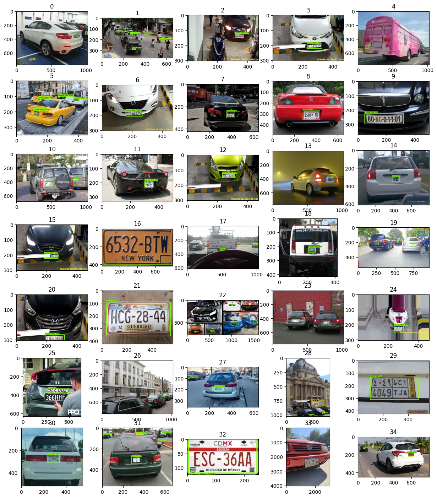
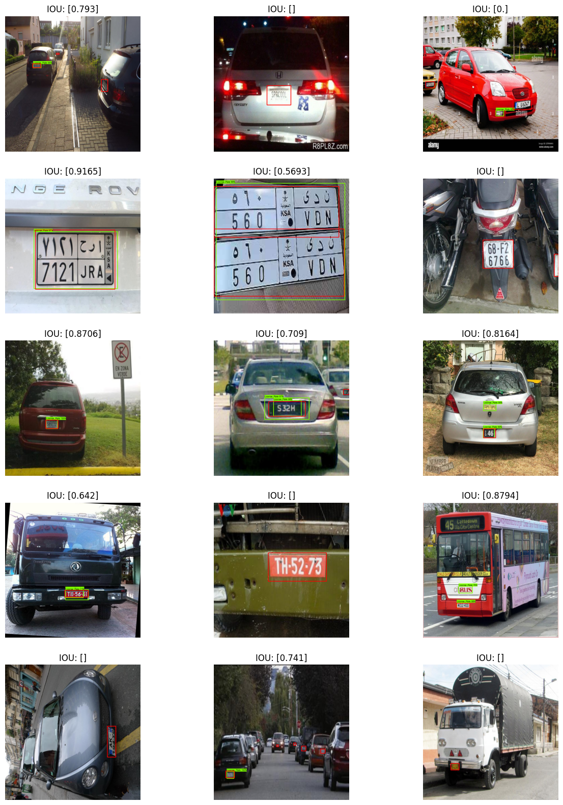

# License Plate Recognition

This project uses Lices Plate recognition dataset from [roboflow](https://universe.roboflow.com/roboflow-universe-projects/license-plate-recognition-rxg4e).

* It uses Densenet model [ssd_resnet50_v1_fpn_640x640_coco17_tpu-8](http://download.tensorflow.org/models/object_detection/tf2/20200711/ssd_resnet50_v1_fpn_640x640_coco17_tpu-8.tar.gz) with tensorflow's object detection api.



## HowTos
### HowTo Setup the project
1. Install uv 
```bash
curl -LsSf https://astral.sh/uv/install.sh | sh
```
2. Run
```bash
uv sync
```
### HowTo Setup project in docker container
1. Install VS code and docker with dev container extensions
2. Enter `ctrl + shift + p` and select `Dev Container: Rebuild Container`


## References
    1. https://github.com/tensorflow/models/blob/master/research/object_detection/colab_tutorials/eager_few_shot_od_training_tf2_colab.ipynb
    2. https://tensorflow-object-detection-api-tutorial.readthedocs.io/en/latest/training.html#evaluating-the-model-optional